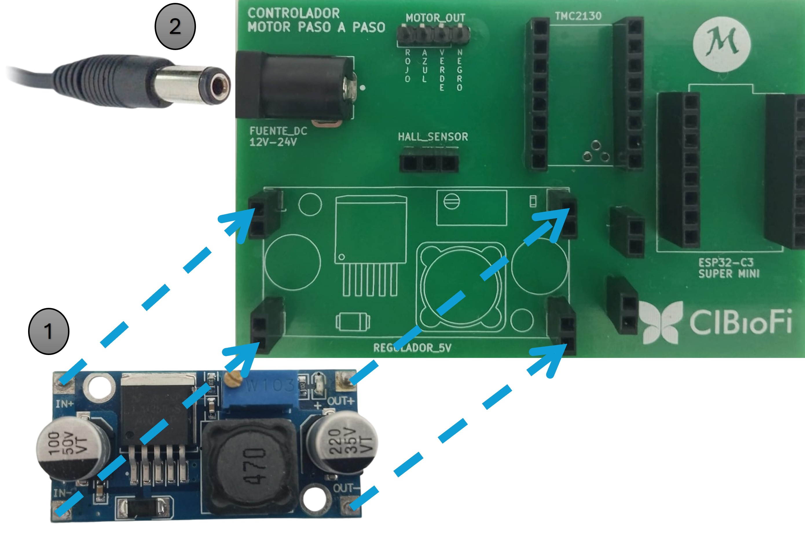
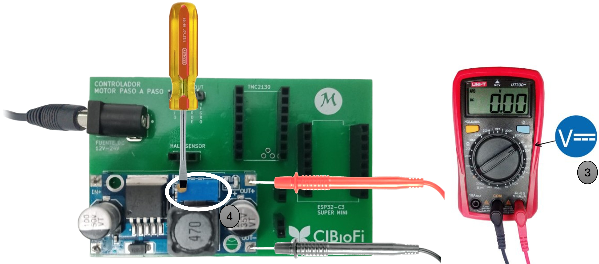
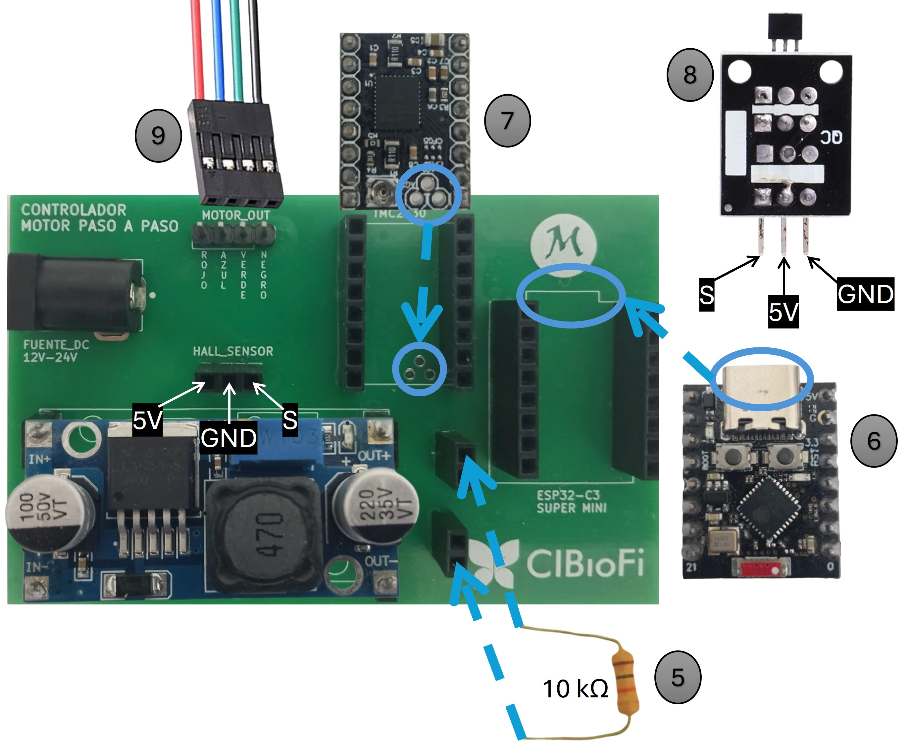
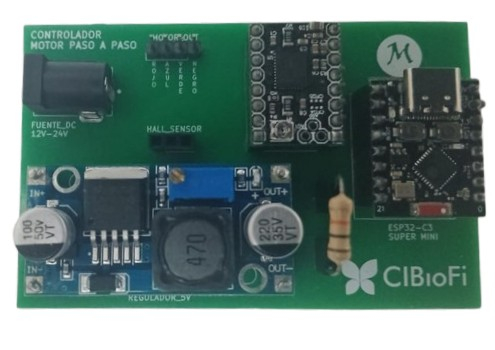

# Repositorio CIBioFi

Este repositorio contiene los recursos necesarios para configurar y manejar las placas de control de motores paso a paso del CIBioFi, donde cada placa controla un motor individual con precisión. Su desarrollo está orientado principalmente a la automatización de sistemas que requieren posicionamiento rápido y exacto, incluyendo aplicaciones en criptografía cuántica como la implementación del protocolo BB84 y otros experimentos de óptica cuántica.

## Manual de Usuario

### Guía de Montaje - PCB para Control de Motores Paso a Paso


#### Paso 1: Conexión del regulador y la fuente de alimentación

Primero se conecta el regulador LM2596 **(1)** y luego la fuente de alimentación externa DC **(2)**. El regulador fija el voltaje de entrada en un valor estable y seguro, el cual sirve de alimentación para los demás componentes del circuito.



#### Paso 2: Ajuste del voltaje de salida del regulador

Con la fuente ya conectada, se verifica que el regulador entregue exactamente 5V:

- Se usa un multímetro en modo voltaje DC **(3)**
- Se colocan sus puntas en los terminales de salida del regulador, la punta roja en el terminal positivo (OUT+) y la punta negra en el terminal negativo (OUT-)
- Con un destornillador de pala, se gira el trimmer del regulador **(4)** hasta que el multímetro muestre 5.0V
- **No se debe conectar ningún otro componente hasta completar este ajuste**



#### Paso 3: Ubicación de componentes

Una vez verificado el voltaje de salida del regulador, se desconecta la alimentación de entrada y se ubican los demás componentes respetando cuidadosamente su orientación:

- La **resistencia de 10 kΩ (5)** (en caso de no estar soldada en la placa), su orientación no es relevante
- El **microcontrolador ESP32-C3 Super Mini (6)**, alineando el conector USB
- El **driver TMC2130 (7)**, alineando las 3 ranuras inferiores
- Los **cables del sensor de efecto Hall (8)** (5V, GND, Señal)
- Los **cables hacia los motores paso a paso (9)**, guiandose por los colores indicados sobre la placa.



#### Ejemplo de montaje completo

El montaje completo, sin los cables del motor y del sensor, debe verse de la siguiente manera:



*Imagen de referencia mostrando la PCB con los componentes correctamente ubicados.*

---

## Clonar el Repositorio en tu Equipo Local

Para tener acceso a todos los proyectos en tu computadora local.

### Prerrequisitos
- Git instalado en tu sistema ([descargar aquí](https://git-scm.com/download/win))

### Pasos para Clonar

**1. Abre una terminal (PowerShell o CMD) y navega a la carpeta donde quieres guardar el repositorio con los proyectos:**

```powershell
cd C:\Users\TU_USUARIO\Desktop
```

**2. Clona el repositorio:**

```powershell
git clone https://github.com/Juank-git/Cibiofi.git
```

**3. Entra a la carpeta del proyecto:**

```powershell
cd Cibiofi
```

**4. Abre el proyecto en VS Code:**

```powershell
code .
```

O simplemente abre VS Code y usa `Archivo > Abrir Carpeta` para seleccionar la carpeta clonada.

### Actualizar el Repositorio

Para obtener los cambios más recientes del repositorio:

```powershell
git pull origin
```

**Nota:** Cada carpeta del proyecto contiene instrucciones específicas sobre cómo cargar el código a los microcontroladores.