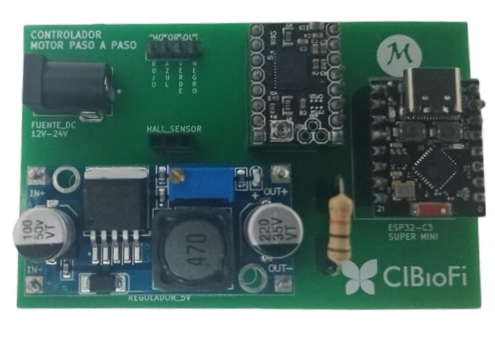

# Proyecto BB84 - Criptografía Cuántica

Proyecto de implementación del protocolo BB84 para distribución de claves cuánticas.

## Manual de Usuario

### Montaje de la PCB

Primero se instala el **(1) regulador de voltaje step-down**, ya que es el encargado de convertir la tensión de entrada a 5 V estables para la placa. Después se conecta la **(2) fuente de alimentación externa** al conector de la PCB, que será la que alimente todo el sistema a través del regulador. A continuación, se verifica la **(3) resistencia de 10 kΩ**: en algunas placas ya viene soldada, pero si no está presente, debe colocarse porque es el valor recomendado por el fabricante del sensor para que funcione correctamente.

Luego se inserta el **(4) microcontrolador ESP32-C3 Super Mini** en los pines centrales respetando la orientación del conector USB. Después se coloca el **(5) driver TMC2130**, encargado del control de los motores paso a paso. Seguidamente se conectan los **(6) cables del sensor de efecto Hall** en los pines indicados (3.3 V, GND y señal). Finalmente, se conectan los **(7) cables de salida hacia los motores**, completando así el montaje físico del sistema sobre la PCB.

#### Ejemplo de montaje completo

*Imagen de referencia mostrando la PCB con todos los componentes correctamente instalados.*